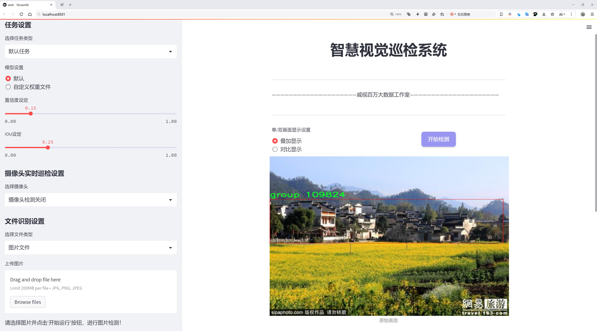

# 村落检测检测系统源码分享
 # [一条龙教学YOLOV8标注好的数据集一键训练_70+全套改进创新点发刊_Web前端展示]

### 1.研究背景与意义

项目参考[AAAI Association for the Advancement of Artificial Intelligence](https://gitee.com/qunshansj/projects)

项目来源[AACV Association for the Advancement of Computer Vision](https://gitee.com/qunmasj/projects)

研究背景与意义

随着城市化进程的加快，乡村地区的变化日益显著，尤其是在土地利用、人口流动和社会经济结构等方面。村落作为乡村的基本单元，承载着丰富的文化和历史，然而，许多村落正面临着被遗忘或消失的风险。因此，开展村落检测研究，及时、准确地识别和监测村落的变化，具有重要的学术价值和社会意义。近年来，计算机视觉技术的快速发展为村落检测提供了新的思路和方法，尤其是基于深度学习的目标检测算法，如YOLO（You Only Look Once）系列，因其高效性和准确性，逐渐成为研究的热点。

本研究旨在基于改进的YOLOv8模型，构建一个高效的村落检测系统。YOLOv8作为YOLO系列的最新版本，具有更快的推理速度和更高的检测精度，适合在复杂的乡村环境中进行实时检测。通过对YOLOv8模型的改进，结合特定的村落数据集，我们希望能够提升模型在乡村场景中的表现，尤其是在多样化的地形、光照和天气条件下的适应能力。

本研究所使用的数据集包含1542张图像，涵盖了两个主要类别，分别为“村落”和“非村落”。这些图像的多样性为模型的训练提供了丰富的样本，有助于提高模型的泛化能力。通过对这些图像的标注和分析，我们可以深入理解村落的特征，进而为模型的优化提供依据。此外，数据集的规模和类别设置也为后续的研究提供了基础，能够为其他相关领域的研究者提供参考。

在理论层面，本研究将为目标检测领域的研究提供新的视角，尤其是在乡村环境下的应用。通过改进YOLOv8模型，我们希望能够在提高检测精度的同时，降低计算资源的消耗，使得该模型能够在资源有限的环境中有效运行。这不仅有助于推动目标检测技术的发展，也为乡村监测、生态保护和文化遗产保护等实际应用提供了技术支持。

在实践层面，村落检测系统的构建将为政府和相关机构提供重要的数据支持，帮助其制定科学的乡村发展政策和保护措施。通过对村落的实时监测，能够及时发现和解决乡村发展中出现的问题，促进乡村的可持续发展。此外，该系统还可以为学术研究提供数据支持，推动乡村研究的深入开展，促进乡村文化的传承与保护。

综上所述，基于改进YOLOv8的村落检测系统的研究，不仅具有重要的理论意义，也为乡村的可持续发展提供了实践支持。通过对村落的有效监测，我们能够更好地理解乡村的变化，推动乡村振兴战略的实施，最终实现人与自然的和谐共生。

### 2.图片演示





##### 注意：由于此博客编辑较早，上面“2.图片演示”和“3.视频演示”展示的系统图片或者视频可能为老版本，新版本在老版本的基础上升级如下：（实际效果以升级的新版本为准）

  （1）适配了YOLOV8的“目标检测”模型和“实例分割”模型，通过加载相应的权重（.pt）文件即可自适应加载模型。

  （2）支持“图片识别”、“视频识别”、“摄像头实时识别”三种识别模式。

  （3）支持“图片识别”、“视频识别”、“摄像头实时识别”三种识别结果保存导出，解决手动导出（容易卡顿出现爆内存）存在的问题，识别完自动保存结果并导出到tempDir中。

  （4）支持Web前端系统中的标题、背景图等自定义修改，后面提供修改教程。

  另外本项目提供训练的数据集和训练教程,暂不提供权重文件（best.pt）,需要您按照教程进行训练后实现图片演示和Web前端界面演示的效果。

### 3.视频演示

[3.1 视频演示](https://www.bilibili.com/video/BV1iftYeSEzZ/)

### 4.数据集信息展示

##### 4.1 本项目数据集详细数据（类别数＆类别名）

nc: 2
names: ['-', 'group']


##### 4.2 本项目数据集信息介绍

数据集信息展示

在本研究中，我们使用的数据集名为“group”，该数据集专门用于训练和改进YOLOv8模型，以实现高效的村落检测系统。该数据集的设计旨在满足特定的应用需求，尤其是在复杂的乡村环境中，准确识别和定位村落的能力至关重要。数据集的类别数量为2，类别列表包括“–”和“group”，其中“group”代表了我们关注的主要目标——村落。

“group”数据集的构建过程涉及多种数据收集方法，包括实地拍摄、卫星图像获取以及现有地理信息系统（GIS）数据的整合。这些数据来源确保了数据集的多样性和丰富性，使得模型能够在不同的环境条件下进行训练。数据集中包含了大量的图像样本，这些样本涵盖了不同季节、不同光照条件以及不同地理特征的村落场景。这种多样性不仅提高了模型的泛化能力，还增强了其在实际应用中的鲁棒性。

在数据标注方面，我们采用了严格的标注标准，以确保每个图像中的村落区域都被准确地框定。标注工作由经验丰富的专家团队完成，他们对村落的特征有着深刻的理解。每个图像的标注信息被系统化地记录，便于后续的模型训练和评估。数据集中的每个样本都经过精心挑选，确保其在视觉上具有代表性，并能够反映出村落的多样性和复杂性。

为了进一步提升模型的性能，我们还对数据集进行了数据增强处理。这包括图像旋转、缩放、翻转以及亮度和对比度的调整等。这些增强技术的应用不仅增加了训练样本的数量，还提高了模型对不同场景的适应能力，使其能够更好地应对实际应用中可能遇到的各种情况。

在模型训练过程中，我们将“group”数据集与YOLOv8模型相结合，利用其先进的特征提取和目标检测能力，进行多轮迭代训练。通过不断优化模型参数和调整网络结构，我们期望能够显著提高村落检测的准确性和效率。此外，模型的评估将基于标准的性能指标，如精确率、召回率和F1-score等，以确保其在实际应用中的可靠性。

总之，“group”数据集的构建和应用为改进YOLOv8的村落检测系统提供了坚实的基础。通过高质量的数据样本和严格的标注标准，我们希望能够实现对村落的精准检测，为乡村发展、土地管理和资源分配等领域提供重要的支持。随着研究的深入，我们相信这一数据集将为未来的相关研究和应用提供宝贵的参考和借鉴。


### 5.全套项目环境部署视频教程（零基础手把手教学）

[5.1 环境部署教程链接（零基础手把手教学）](https://www.ixigua.com/7404473917358506534?logTag=c807d0cbc21c0ef59de5)


[5.2 安装Python虚拟环境创建和依赖库安装视频教程链接（零基础手把手教学）](https://www.ixigua.com/7404474678003106304?logTag=1f1041108cd1f708b01a)

### 6.手把手YOLOV8训练视频教程（零基础小白有手就能学会）

[6.1 手把手YOLOV8训练视频教程（零基础小白有手就能学会）](https://www.ixigua.com/7404477157818401292?logTag=d31a2dfd1983c9668658)

### 7.70+种全套YOLOV8创新点代码加载调参视频教程（一键加载写好的改进模型的配置文件）

[7.1 70+种全套YOLOV8创新点代码加载调参视频教程（一键加载写好的改进模型的配置文件）](https://www.ixigua.com/7404478314661806627?logTag=29066f8288e3f4eea3a4)

### 8.70+种全套YOLOV8创新点原理讲解（非科班也可以轻松写刊发刊，V10版本正在科研待更新）

由于篇幅限制，每个创新点的具体原理讲解就不一一展开，具体见下列网址中的创新点对应子项目的技术原理博客网址【Blog】：


[8.1 70+种全套YOLOV8创新点原理讲解链接](https://gitee.com/qunmasj/good)

### 9.系统功能展示（检测对象为举例，实际内容以本项目数据集为准）

图9.1.系统支持检测结果表格显示

  图9.2.系统支持置信度和IOU阈值手动调节

  图9.3.系统支持自定义加载权重文件best.pt(需要你通过步骤5中训练获得)

  图9.4.系统支持摄像头实时识别

  图9.5.系统支持图片识别

  图9.6.系统支持视频识别

  图9.7.系统支持识别结果文件自动保存

  图9.8.系统支持Excel导出检测结果数据


### 10.原始YOLOV8算法原理

原始YOLOv8算法原理

YOLOv8作为2023年由Ultralytics发布的最新目标检测模型，标志着目标检测领域的又一次重大进步。它不仅融合了之前YOLO系列的多项设计理念，还在此基础上进行了创新与优化，使得其在精度和速度上都达到了新的高度。YOLOv8的设计思路深受YOLOX、YOLOv6、YOLOv7以及PPYOLOE等算法的启发，尤其是在Head标签分配和Loss计算部分，YOLOv8与PP-YOLOE有着显著的相似性。这种设计的集合，使得YOLOv8在实时检测任务中展现出极强的竞争力，能够为各种应用场景提供高效的解决方案。

YOLOv8的架构主要由输入层、主干网络、颈部网络和头部网络组成。输入层负责对图像进行预处理，包括缩放和归一化，以满足模型的输入要求。主干网络是YOLOv8的核心部分，通过一系列卷积操作对输入图像进行特征提取。每个卷积层后面都应用了批归一化和SiLU激活函数，以提高模型的非线性表达能力和训练稳定性。值得注意的是，YOLOv8引入了C2f块，这一模块借鉴了YOLOv7中的E-ELAN结构，通过跨层分支连接来增强模型的梯度流动，从而有效改善检测性能。

在主干网络的末尾，YOLOv8采用了空间金字塔池化（SPP）模块，通过三个最大池化层处理多尺度特征，进一步增强了网络的特征抽象能力。这一设计使得YOLOv8能够在不同尺度上提取到丰富的特征信息，为后续的目标检测奠定了坚实的基础。颈部网络则利用特征金字塔网络（FPN）和路径聚合网络（PAN）结构，旨在融合来自不同尺度的特征图信息，确保在目标检测过程中充分利用各层特征的优势。

YOLOv8的头部网络采用了解耦的检测头设计，分别通过两个并行的卷积分支来计算回归和分类的损失。这种设计使得模型在处理目标检测任务时，能够更加精准地对目标进行定位和分类。YOLOv8在损失计算上也进行了创新，采用了变焦损失来计算分类损失，并引入数据平均保真度损失和完美交并比损失来优化边界框的损失。这种新的损失策略使得YOLOv8在处理复杂场景时，能够更好地平衡精度与召回率，从而提高整体检测性能。

YOLOv8的设计理念强调高效性与准确性的结合。在骨干网络中，YOLOv8依然采用了跨级结构（Cross Stage Partial, CSP）的思想，但对YOLOv5中的C3模块进行了优化，替换为更加轻量的结构。这一改进不仅降低了模型的计算复杂度，还提高了特征提取的效率。同时，YOLOv8保留了空间金字塔池化模块，确保了多尺度特征的有效利用。值得一提的是，YOLOv8在特征金字塔思想的基础上，删除了上采样阶段中的卷积结构，这一简化设计进一步提升了模型的运行速度。

通过上述改进，YOLOv8能够在保证高效率的同时，实现更加准确的目标检测。新的样本匹配方式和损失计算策略，使得YOLOv8在面对各种复杂场景时，依然能够保持出色的性能。这种灵活性和适应性，使得YOLOv8在实际应用中展现出广泛的前景。

在苹果采摘的应用场景中，YOLOv8的视觉识别能力能够自动检测和定位苹果，为自动采摘机器人提供必要的支持。结合蚁群算法进行路径规划，能够使得机器人在采摘过程中快速而高效地完成任务。这种结合不仅提高了苹果采摘的效率，也为农业自动化提供了新的思路。

总的来说，YOLOv8作为一款新一代目标检测模型，通过融合多种先进设计理念，展现出了高精度和快速响应的特点。它的出现不仅推动了目标检测技术的发展，也为各类实际应用提供了强有力的技术支持。随着YOLOv8的不断完善和应用推广，未来的目标检测领域将迎来更多的创新与突破。


### 11.项目核心源码讲解（再也不用担心看不懂代码逻辑）

#### 11.1 70+种YOLOv8算法改进源码大全和调试加载训练教程（非必要）\ultralytics\models\sam\modules\transformer.py

以下是对给定代码的核心部分进行提炼和详细注释的结果。主要保留了 `TwoWayTransformer`、`TwoWayAttentionBlock` 和 `Attention` 类的核心实现，以及它们的主要功能。

```python
import math
from typing import Tuple, Type
import torch
from torch import Tensor, nn
from ultralytics.nn.modules import MLPBlock

class TwoWayTransformer(nn.Module):
    """
    双向变换器模块，能够同时关注图像和查询点。此类作为一个专门的变换器解码器，使用提供的查询位置嵌入来关注输入图像。
    适用于目标检测、图像分割和点云处理等任务。
    """

    def __init__(self, depth: int, embedding_dim: int, num_heads: int, mlp_dim: int, activation: Type[nn.Module] = nn.ReLU, attention_downsample_rate: int = 2) -> None:
        """
        初始化双向变换器。

        Args:
          depth (int): 变换器的层数
          embedding_dim (int): 输入嵌入的通道维度
          num_heads (int): 多头注意力的头数
          mlp_dim (int): MLP块的内部通道维度
        """
        super().__init__()
        self.depth = depth
        self.embedding_dim = embedding_dim
        self.num_heads = num_heads
        self.mlp_dim = mlp_dim
        self.layers = nn.ModuleList()

        # 添加多个双向注意力块
        for i in range(depth):
            self.layers.append(
                TwoWayAttentionBlock(
                    embedding_dim=embedding_dim,
                    num_heads=num_heads,
                    mlp_dim=mlp_dim,
                    activation=activation,
                    attention_downsample_rate=attention_downsample_rate,
                    skip_first_layer_pe=(i == 0),
                ))

        # 最后的注意力层和归一化层
        self.final_attn_token_to_image = Attention(embedding_dim, num_heads, downsample_rate=attention_downsample_rate)
        self.norm_final_attn = nn.LayerNorm(embedding_dim)

    def forward(self, image_embedding: Tensor, image_pe: Tensor, point_embedding: Tensor) -> Tuple[Tensor, Tensor]:
        """
        前向传播，处理图像和查询点的嵌入。

        Args:
          image_embedding (torch.Tensor): 输入图像的嵌入
          image_pe (torch.Tensor): 图像的位置信息
          point_embedding (torch.Tensor): 查询点的嵌入

        Returns:
          (torch.Tensor): 处理后的查询点嵌入
          (torch.Tensor): 处理后的图像嵌入
        """
        # 将图像嵌入展平并转置
        bs, c, h, w = image_embedding.shape
        image_embedding = image_embedding.flatten(2).permute(0, 2, 1)
        image_pe = image_pe.flatten(2).permute(0, 2, 1)

        # 准备查询和键
        queries = point_embedding
        keys = image_embedding

        # 应用变换器块
        for layer in self.layers:
            queries, keys = layer(queries=queries, keys=keys, query_pe=point_embedding, key_pe=image_pe)

        # 最后的注意力层
        q = queries + point_embedding
        k = keys + image_pe
        attn_out = self.final_attn_token_to_image(q=q, k=k, v=keys)
        queries = queries + attn_out
        queries = self.norm_final_attn(queries)

        return queries, keys


class TwoWayAttentionBlock(nn.Module):
    """
    一个注意力块，执行自注意力和交叉注意力，支持查询到键和键到查询的双向注意力。
    包含四个主要层：自注意力、交叉注意力、MLP块和再次的交叉注意力。
    """

    def __init__(self, embedding_dim: int, num_heads: int, mlp_dim: int = 2048, activation: Type[nn.Module] = nn.ReLU, attention_downsample_rate: int = 2, skip_first_layer_pe: bool = False) -> None:
        """
        初始化双向注意力块。

        Args:
          embedding_dim (int): 嵌入的通道维度
          num_heads (int): 注意力层的头数
          mlp_dim (int): MLP块的隐藏维度
          activation (nn.Module): MLP块的激活函数
          skip_first_layer_pe (bool): 是否在第一层跳过位置编码
        """
        super().__init__()
        self.self_attn = Attention(embedding_dim, num_heads)
        self.norm1 = nn.LayerNorm(embedding_dim)

        self.cross_attn_token_to_image = Attention(embedding_dim, num_heads, downsample_rate=attention_downsample_rate)
        self.norm2 = nn.LayerNorm(embedding_dim)

        self.mlp = MLPBlock(embedding_dim, mlp_dim, activation)
        self.norm3 = nn.LayerNorm(embedding_dim)

        self.norm4 = nn.LayerNorm(embedding_dim)
        self.cross_attn_image_to_token = Attention(embedding_dim, num_heads, downsample_rate=attention_downsample_rate)

        self.skip_first_layer_pe = skip_first_layer_pe

    def forward(self, queries: Tensor, keys: Tensor, query_pe: Tensor, key_pe: Tensor) -> Tuple[Tensor, Tensor]:
        """应用自注意力和交叉注意力，并返回处理后的嵌入。"""

        # 自注意力块
        if self.skip_first_layer_pe:
            queries = self.self_attn(q=queries, k=queries, v=queries)
        else:
            q = queries + query_pe
            attn_out = self.self_attn(q=q, k=q, v=queries)
            queries = queries + attn_out
        queries = self.norm1(queries)

        # 交叉注意力块，查询点关注图像嵌入
        q = queries + query_pe
        k = keys + key_pe
        attn_out = self.cross_attn_token_to_image(q=q, k=k, v=keys)
        queries = queries + attn_out
        queries = self.norm2(queries)

        # MLP块
        mlp_out = self.mlp(queries)
        queries = queries + mlp_out
        queries = self.norm3(queries)

        # 再次的交叉注意力块，图像嵌入关注查询点
        q = queries + query_pe
        k = keys + key_pe
        attn_out = self.cross_attn_image_to_token(q=k, k=q, v=queries)
        keys = keys + attn_out
        keys = self.norm4(keys)

        return queries, keys


class Attention(nn.Module):
    """一个注意力层，允许在投影到查询、键和值后对嵌入的大小进行下采样。"""

    def __init__(self, embedding_dim: int, num_heads: int, downsample_rate: int = 1) -> None:
        """
        初始化注意力模型。

        Args:
            embedding_dim (int): 输入嵌入的维度。
            num_heads (int): 注意力头的数量。
            downsample_rate (int, optional): 内部维度的下采样因子。默认为1。
        """
        super().__init__()
        self.embedding_dim = embedding_dim
        self.internal_dim = embedding_dim // downsample_rate
        self.num_heads = num_heads
        assert self.internal_dim % num_heads == 0, 'num_heads must divide embedding_dim.'

        # 定义线性层用于查询、键和值的投影
        self.q_proj = nn.Linear(embedding_dim, self.internal_dim)
        self.k_proj = nn.Linear(embedding_dim, self.internal_dim)
        self.v_proj = nn.Linear(embedding_dim, self.internal_dim)
        self.out_proj = nn.Linear(self.internal_dim, embedding_dim)

    @staticmethod
    def _separate_heads(x: Tensor, num_heads: int) -> Tensor:
        """将输入张量分离为指定数量的注意力头。"""
        b, n, c = x.shape
        x = x.reshape(b, n, num_heads, c // num_heads)
        return x.transpose(1, 2)  # B x N_heads x N_tokens x C_per_head

    @staticmethod
    def _recombine_heads(x: Tensor) -> Tensor:
        """将分离的注意力头重新组合为单个张量。"""
        b, n_heads, n_tokens, c_per_head = x.shape
        x = x.transpose(1, 2)
        return x.reshape(b, n_tokens, n_heads * c_per_head)  # B x N_tokens x C

    def forward(self, q: Tensor, k: Tensor, v: Tensor) -> Tensor:
        """计算给定输入查询、键和值张量的注意力输出。"""

        # 输入投影
        q = self.q_proj(q)
        k = self.k_proj(k)
        v = self.v_proj(v)

        # 分离为头
        q = self._separate_heads(q, self.num_heads)
        k = self._separate_heads(k, self.num_heads)
        v = self._separate_heads(v, self.num_heads)

        # 计算注意力
        _, _, _, c_per_head = q.shape
        attn = q @ k.permute(0, 1, 3, 2)  # B x N_heads x N_tokens x N_tokens
        attn = attn / math.sqrt(c_per_head)  # 缩放
        attn = torch.softmax(attn, dim=-1)  # 归一化

        # 获取输出
        out = attn @ v
        out = self._recombine_heads(out)
        return self.out_proj(out)  # 投影回原始维度
```

### 代码说明
1. **TwoWayTransformer**: 该类实现了一个双向变换器，能够处理图像和查询点的嵌入。它包含多个双向注意力块，并在最后应用一个注意力层和归一化层。

2. **TwoWayAttentionBlock**: 该类实现了一个注意力块，执行自注意力和交叉注意力。它包含四个主要部分：自注意力、交叉注意力、MLP块和再次的交叉注意力。

3. **Attention**: 该类实现了一个注意力机制，支持将输入嵌入投影到查询、键和值，并允许在投影后对嵌入的大小进行下采样。它还包含了分离和重新组合注意力头的静态方法。

通过以上注释，代码的结构和功能得到了清晰的阐述，便于理解和后续的开发。

这个文件定义了一个名为 `TwoWayTransformer` 的类，它是一个双向变换器模块，能够同时关注图像和查询点。这个类作为一个专门的变换器解码器，使用提供的查询位置嵌入来关注输入图像，特别适用于目标检测、图像分割和点云处理等任务。

在 `TwoWayTransformer` 类的构造函数中，初始化了一些重要的参数，包括变换器的层数（`depth`）、输入嵌入的通道维度（`embedding_dim`）、多头注意力的头数（`num_heads`）、MLP块的内部通道维度（`mlp_dim`）等。随后，通过循环创建了多个 `TwoWayAttentionBlock` 层，并将它们存储在 `layers` 列表中。此外，还定义了一个最终的注意力层和一个层归一化层。

`forward` 方法接受三个输入：图像嵌入、图像位置编码和查询点嵌入。首先，将图像嵌入和位置编码进行展平和转置，以便于后续处理。然后，准备查询和键的输入，接着依次通过每个变换器层进行处理。最后，应用最终的注意力层和层归一化，返回处理后的查询和键。

`TwoWayAttentionBlock` 类实现了一个注意力块，执行自注意力和交叉注意力，具有四个主要层：稀疏输入的自注意力、稀疏输入到密集输入的交叉注意力、稀疏输入的MLP块，以及密集输入到稀疏输入的交叉注意力。构造函数中初始化了这些层，并设置了是否跳过第一层的位置编码。

在 `TwoWayAttentionBlock` 的 `forward` 方法中，首先处理自注意力块，然后进行稀疏输入到密集输入的交叉注意力，接着通过MLP块进行处理，最后进行密集输入到稀疏输入的交叉注意力。每一步都进行了层归一化，以确保输出的稳定性。

`Attention` 类实现了一个注意力层，允许在投影到查询、键和值之后对嵌入的大小进行下采样。构造函数中初始化了输入嵌入的维度、注意力头的数量和下采样率。该类还定义了 `_separate_heads` 和 `_recombine_heads` 方法，用于将输入张量分离成多个注意力头和重新组合这些头。

在 `Attention` 的 `forward` 方法中，首先对输入的查询、键和值进行线性投影，然后将它们分离成多个头。接着计算注意力权重，并通过softmax函数进行归一化，最后将注意力输出与值相乘，并重新组合头，最终输出结果。

整体来看，这个文件实现了一个复杂的双向变换器结构，结合了自注意力和交叉注意力机制，适用于多种计算机视觉任务。

#### 11.2 70+种YOLOv8算法改进源码大全和调试加载训练教程（非必要）\ultralytics\trackers\utils\matching.py

以下是代码中最核心的部分，并附上详细的中文注释：

```python
import numpy as np
import scipy
from scipy.spatial.distance import cdist
from ultralytics.utils.metrics import bbox_ioa

try:
    import lap  # 导入线性分配库

    assert lap.__version__  # 验证包不是目录
except (ImportError, AssertionError, AttributeError):
    from ultralytics.utils.checks import check_requirements

    check_requirements('lapx>=0.5.2')  # 更新到 lap 包
    import lap


def linear_assignment(cost_matrix, thresh, use_lap=True):
    """
    使用 scipy 或 lap.lapjv 进行线性分配。

    参数:
        cost_matrix (np.ndarray): 包含分配成本值的矩阵。
        thresh (float): 认为分配有效的阈值。
        use_lap (bool, optional): 是否使用 lap.lapjv。默认为 True。

    返回:
        (tuple): 包含匹配索引、未匹配的索引 a 和未匹配的索引 b 的元组。
    """

    # 如果成本矩阵为空，返回空匹配和所有未匹配的索引
    if cost_matrix.size == 0:
        return np.empty((0, 2), dtype=int), tuple(range(cost_matrix.shape[0])), tuple(range(cost_matrix.shape[1]))

    if use_lap:
        # 使用 lap.lapjv 进行线性分配
        _, x, y = lap.lapjv(cost_matrix, extend_cost=True, cost_limit=thresh)
        matches = [[ix, mx] for ix, mx in enumerate(x) if mx >= 0]  # 找到匹配的索引
        unmatched_a = np.where(x < 0)[0]  # 找到未匹配的 a 索引
        unmatched_b = np.where(y < 0)[0]  # 找到未匹配的 b 索引
    else:
        # 使用 scipy 的线性和分配算法
        x, y = scipy.optimize.linear_sum_assignment(cost_matrix)  # 行 x，列 y
        matches = np.asarray([[x[i], y[i]] for i in range(len(x)) if cost_matrix[x[i], y[i]] <= thresh])
        if len(matches) == 0:
            unmatched_a = list(np.arange(cost_matrix.shape[0]))
            unmatched_b = list(np.arange(cost_matrix.shape[1]))
        else:
            unmatched_a = list(set(np.arange(cost_matrix.shape[0])) - set(matches[:, 0]))
            unmatched_b = list(set(np.arange(cost_matrix.shape[1])) - set(matches[:, 1]))

    return matches, unmatched_a, unmatched_b  # 返回匹配和未匹配的索引


def iou_distance(atracks, btracks):
    """
    基于交并比 (IoU) 计算轨迹之间的成本。

    参数:
        atracks (list[STrack] | list[np.ndarray]): 轨迹 'a' 或边界框的列表。
        btracks (list[STrack] | list[np.ndarray]): 轨迹 'b' 或边界框的列表。

    返回:
        (np.ndarray): 基于 IoU 计算的成本矩阵。
    """

    # 确定输入类型，获取边界框
    if (len(atracks) > 0 and isinstance(atracks[0], np.ndarray)) \
            or (len(btracks) > 0 and isinstance(btracks[0], np.ndarray)):
        atlbrs = atracks
        btlbrs = btracks
    else:
        atlbrs = [track.tlbr for track in atracks]  # 获取轨迹 'a' 的边界框
        btlbrs = [track.tlbr for track in btracks]  # 获取轨迹 'b' 的边界框

    ious = np.zeros((len(atlbrs), len(btlbrs)), dtype=np.float32)  # 初始化 IoU 矩阵
    if len(atlbrs) and len(btlbrs):
        # 计算 IoU
        ious = bbox_ioa(np.ascontiguousarray(atlbrs, dtype=np.float32),
                        np.ascontiguousarray(btlbrs, dtype=np.float32),
                        iou=True)
    return 1 - ious  # 返回成本矩阵


def embedding_distance(tracks, detections, metric='cosine'):
    """
    基于嵌入计算轨迹和检测之间的距离。

    参数:
        tracks (list[STrack]): 轨迹列表。
        detections (list[BaseTrack]): 检测列表。
        metric (str, optional): 距离计算的度量。默认为 'cosine'。

    返回:
        (np.ndarray): 基于嵌入计算的成本矩阵。
    """

    cost_matrix = np.zeros((len(tracks), len(detections)), dtype=np.float32)  # 初始化成本矩阵
    if cost_matrix.size == 0:
        return cost_matrix
    det_features = np.asarray([track.curr_feat for track in detections], dtype=np.float32)  # 获取检测特征
    track_features = np.asarray([track.smooth_feat for track in tracks], dtype=np.float32)  # 获取轨迹特征
    cost_matrix = np.maximum(0.0, cdist(track_features, det_features, metric))  # 计算距离
    return cost_matrix  # 返回成本矩阵


def fuse_score(cost_matrix, detections):
    """
    将成本矩阵与检测分数融合以生成单一相似度矩阵。

    参数:
        cost_matrix (np.ndarray): 包含分配成本值的矩阵。
        detections (list[BaseTrack]): 带有分数的检测列表。

    返回:
        (np.ndarray): 融合后的相似度矩阵。
    """

    if cost_matrix.size == 0:
        return cost_matrix
    iou_sim = 1 - cost_matrix  # 计算 IoU 相似度
    det_scores = np.array([det.score for det in detections])  # 获取检测分数
    det_scores = np.expand_dims(det_scores, axis=0).repeat(cost_matrix.shape[0], axis=0)  # 扩展分数维度
    fuse_sim = iou_sim * det_scores  # 融合相似度
    return 1 - fuse_sim  # 返回融合后的成本矩阵
```

### 代码说明：
1. **linear_assignment**: 该函数实现了线性分配算法，使用成本矩阵和阈值来找到最佳匹配。可以选择使用 `lap` 库或 `scipy` 库来进行计算。
2. **iou_distance**: 该函数计算给定轨迹之间的交并比 (IoU)，并返回一个成本矩阵。IoU 越高，成本越低。
3. **embedding_distance**: 该函数计算轨迹和检测之间的距离，基于特征嵌入，返回一个成本矩阵。
4. **fuse_score**: 该函数将成本矩阵与检测分数融合，生成一个综合的相似度矩阵，以便更好地进行匹配。

这个程序文件是用于实现YOLOv8算法中的匹配功能，主要涉及目标跟踪的线性分配和距离计算。文件中包含了多个函数，分别用于处理不同的匹配和距离计算任务。

首先，文件导入了必要的库，包括NumPy和SciPy，以及用于计算交并比（IoU）的自定义函数`bbox_ioa`。在导入`lap`库时，程序会检查其版本，如果未安装该库，则会调用`check_requirements`函数来确保所需的依赖项被正确安装。

接下来，`linear_assignment`函数用于执行线性分配。它接受一个成本矩阵、一个阈值和一个可选参数来决定是否使用`lap`库进行计算。函数首先检查成本矩阵是否为空，如果为空，则返回空的匹配结果和未匹配的索引。若使用`lap`库，函数会调用`lapjv`方法进行匹配，并根据阈值筛选出有效的匹配。否则，使用SciPy的`linear_sum_assignment`方法进行匹配，并同样根据阈值筛选结果。

`iou_distance`函数计算基于交并比的成本矩阵。它接受两个轨迹列表，首先判断输入数据的类型，然后提取出边界框的坐标。接着，调用`bbox_ioa`函数计算IoU值，并将其转换为成本矩阵（1 - IoU）。

`embedding_distance`函数计算轨迹与检测之间的距离，基于特征嵌入。它接受轨迹和检测列表，并使用余弦距离或其他指定的度量方法来计算成本矩阵。函数首先创建一个零成本矩阵，然后提取检测的特征并计算轨迹的特征之间的距离。

最后，`fuse_score`函数将成本矩阵与检测得分融合，生成一个单一的相似度矩阵。它首先计算IoU相似度，然后将检测得分扩展到与成本矩阵相同的形状，最后通过乘法融合得到最终的相似度矩阵。

整体而言，这个文件的功能是为YOLOv8目标跟踪提供匹配和距离计算的基础工具，支持不同的匹配算法和距离度量方法，以便在目标跟踪任务中进行有效的对象匹配。

#### 11.3 ui.py

以下是经过简化和注释的核心代码部分：

```python
import sys
import subprocess

def run_script(script_path):
    """
    使用当前 Python 环境运行指定的脚本。

    Args:
        script_path (str): 要运行的脚本路径

    Returns:
        None
    """
    # 获取当前 Python 解释器的路径
    python_path = sys.executable

    # 构建运行命令，使用 streamlit 运行指定的脚本
    command = f'"{python_path}" -m streamlit run "{script_path}"'

    # 执行命令并等待其完成
    result = subprocess.run(command, shell=True)
    
    # 检查命令执行的返回码，如果不为0，则表示出错
    if result.returncode != 0:
        print("脚本运行出错。")

# 主程序入口
if __name__ == "__main__":
    # 指定要运行的脚本路径
    script_path = "web.py"  # 这里可以直接指定脚本名

    # 调用函数运行脚本
    run_script(script_path)
```

### 代码注释说明：
1. **导入模块**：
   - `sys`：用于获取当前 Python 解释器的路径。
   - `subprocess`：用于执行外部命令。

2. **`run_script` 函数**：
   - 定义了一个函数，用于运行指定路径的 Python 脚本。
   - `script_path` 参数是要运行的脚本的路径。

3. **获取 Python 解释器路径**：
   - 使用 `sys.executable` 获取当前 Python 解释器的完整路径，以便在命令中调用。

4. **构建命令**：
   - 使用 `streamlit` 模块运行指定的脚本，构建一个完整的命令字符串。

5. **执行命令**：
   - 使用 `subprocess.run` 执行构建的命令，并等待其完成。

6. **检查返回码**：
   - 如果命令执行返回码不为0，表示脚本运行出错，打印错误信息。

7. **主程序入口**：
   - 在 `if __name__ == "__main__":` 块中，指定要运行的脚本路径，并调用 `run_script` 函数执行该脚本。

这个程序文件名为 `ui.py`，其主要功能是使用当前的 Python 环境来运行一个指定的脚本，具体是通过 Streamlit 框架来启动一个 Web 应用。

程序首先导入了必要的模块，包括 `sys`、`os` 和 `subprocess`，其中 `sys` 用于访问与 Python 解释器相关的变量和函数，`os` 用于与操作系统交互，而 `subprocess` 则用于执行外部命令。

接着，程序从 `QtFusion.path` 模块中导入了 `abs_path` 函数，这个函数的作用是获取文件的绝对路径。

在 `run_script` 函数中，首先定义了一个参数 `script_path`，它是要运行的脚本的路径。函数内部通过 `sys.executable` 获取当前 Python 解释器的路径，并构建一个命令字符串，该命令用于通过 Streamlit 运行指定的脚本。命令的格式是 `"{python_path}" -m streamlit run "{script_path}"`，其中 `{python_path}` 和 `{script_path}` 会被实际的路径替换。

然后，使用 `subprocess.run` 方法执行这个命令。`shell=True` 参数表示在 shell 中执行命令。执行后，程序会检查返回的状态码，如果不为零，表示脚本运行出错，并会打印出相应的错误信息。

在文件的最后部分，程序通过 `if __name__ == "__main__":` 判断是否是直接运行该脚本。如果是，它会调用 `abs_path` 函数获取 `web.py` 脚本的绝对路径，并将其传递给 `run_script` 函数以启动应用。

总体来说，这个程序的核心功能是简化了通过 Streamlit 启动 Web 应用的过程，使得用户只需指定脚本路径，程序就会自动处理其余的细节。

#### 11.4 train.py

以下是经过简化和注释的核心代码部分：

```python
import random
import numpy as np
import torch.nn as nn
from ultralytics.data import build_dataloader, build_yolo_dataset
from ultralytics.engine.trainer import BaseTrainer
from ultralytics.models import yolo
from ultralytics.nn.tasks import DetectionModel
from ultralytics.utils import LOGGER, RANK
from ultralytics.utils.torch_utils import de_parallel, torch_distributed_zero_first

class DetectionTrainer(BaseTrainer):
    """
    DetectionTrainer类用于基于YOLO模型进行目标检测的训练。
    """

    def build_dataset(self, img_path, mode="train", batch=None):
        """
        构建YOLO数据集。

        参数:
            img_path (str): 包含图像的文件夹路径。
            mode (str): 模式，可以是'train'或'val'，用于自定义不同的增强方法。
            batch (int, optional): 批次大小，仅在'rect'模式下使用。默认为None。
        """
        gs = max(int(de_parallel(self.model).stride.max() if self.model else 0), 32)
        return build_yolo_dataset(self.args, img_path, batch, self.data, mode=mode, rect=mode == "val", stride=gs)

    def get_dataloader(self, dataset_path, batch_size=16, rank=0, mode="train"):
        """构造并返回数据加载器。"""
        assert mode in ["train", "val"]
        with torch_distributed_zero_first(rank):  # 在分布式训练中，仅初始化一次数据集
            dataset = self.build_dataset(dataset_path, mode, batch_size)
        shuffle = mode == "train"  # 训练模式下打乱数据
        workers = self.args.workers if mode == "train" else self.args.workers * 2
        return build_dataloader(dataset, batch_size, workers, shuffle, rank)  # 返回数据加载器

    def preprocess_batch(self, batch):
        """对图像批次进行预处理，包括缩放和转换为浮点数。"""
        batch["img"] = batch["img"].to(self.device, non_blocking=True).float() / 255  # 归一化到[0, 1]
        if self.args.multi_scale:  # 如果启用多尺度训练
            imgs = batch["img"]
            sz = (
                random.randrange(self.args.imgsz * 0.5, self.args.imgsz * 1.5 + self.stride)
                // self.stride
                * self.stride
            )  # 随机选择图像大小
            sf = sz / max(imgs.shape[2:])  # 计算缩放因子
            if sf != 1:
                ns = [
                    math.ceil(x * sf / self.stride) * self.stride for x in imgs.shape[2:]
                ]  # 计算新的图像形状
                imgs = nn.functional.interpolate(imgs, size=ns, mode="bilinear", align_corners=False)  # 进行插值
            batch["img"] = imgs
        return batch

    def set_model_attributes(self):
        """设置模型的属性，包括类别数量和名称。"""
        self.model.nc = self.data["nc"]  # 将类别数量附加到模型
        self.model.names = self.data["names"]  # 将类别名称附加到模型
        self.model.args = self.args  # 将超参数附加到模型

    def get_model(self, cfg=None, weights=None, verbose=True):
        """返回YOLO目标检测模型。"""
        model = DetectionModel(cfg, nc=self.data["nc"], verbose=verbose and RANK == -1)
        if weights:
            model.load(weights)  # 加载权重
        return model

    def plot_training_samples(self, batch, ni):
        """绘制训练样本及其注释。"""
        plot_images(
            images=batch["img"],
            batch_idx=batch["batch_idx"],
            cls=batch["cls"].squeeze(-1),
            bboxes=batch["bboxes"],
            paths=batch["im_file"],
            fname=self.save_dir / f"train_batch{ni}.jpg",
            on_plot=self.on_plot,
        )
```

### 代码注释说明：
1. **类和方法**：`DetectionTrainer`类继承自`BaseTrainer`，用于处理YOLO模型的训练过程。
2. **数据集构建**：`build_dataset`方法用于根据给定的图像路径和模式构建YOLO数据集。
3. **数据加载器**：`get_dataloader`方法构造并返回数据加载器，支持分布式训练。
4. **批次预处理**：`preprocess_batch`方法对输入的图像批次进行归一化和缩放处理，以适应不同的训练需求。
5. **模型属性设置**：`set_model_attributes`方法将类别数量和名称等信息设置到模型中。
6. **模型获取**：`get_model`方法用于创建YOLO检测模型并加载预训练权重（如果有）。
7. **绘制训练样本**：`plot_training_samples`方法用于可视化训练样本及其对应的标注信息。

这个程序文件 `train.py` 是一个用于训练 YOLO（You Only Look Once）目标检测模型的实现，继承自 `BaseTrainer` 类。文件中包含了一系列方法，主要用于构建数据集、加载数据、预处理图像、设置模型属性、获取模型、验证模型、记录损失、显示训练进度、绘制训练样本和指标等。

首先，`DetectionTrainer` 类的构造函数接收一些参数，并定义了如何构建数据集。`build_dataset` 方法根据给定的图像路径和模式（训练或验证）来构建 YOLO 数据集。该方法会调用 `build_yolo_dataset` 函数，设置图像的批量大小和其他参数。

接着，`get_dataloader` 方法用于构建数据加载器。它会根据模式选择是否打乱数据，并根据工作线程数设置加载器的工作线程数量。通过 `torch_distributed_zero_first` 方法确保在分布式训练中只初始化一次数据集。

在数据预处理方面，`preprocess_batch` 方法会将图像缩放并转换为浮点数格式。该方法支持多尺度训练，通过随机选择图像大小来增强模型的鲁棒性。

`set_model_attributes` 方法用于设置模型的属性，包括类别数量和类别名称。这些信息是从数据集中提取的，并附加到模型上。

`get_model` 方法用于返回一个 YOLO 检测模型，可以加载预训练权重。`get_validator` 方法则返回一个用于验证模型的验证器，能够计算损失并进行评估。

在损失记录方面，`label_loss_items` 方法返回一个包含训练损失项的字典，便于后续分析。`progress_string` 方法格式化并返回训练进度的字符串，包括当前的轮次、GPU 内存使用情况、损失值、实例数量和图像大小等信息。

此外，`plot_training_samples` 方法用于绘制训练样本及其标注，便于可视化训练过程中的样本质量。`plot_metrics` 方法从 CSV 文件中绘制训练指标，帮助分析模型性能。最后，`plot_training_labels` 方法生成一个带有标注的训练图，展示模型在训练集上的表现。

整体来看，这个文件提供了一个完整的框架，用于训练 YOLO 模型，涵盖了数据处理、模型训练、验证和结果可视化等多个方面。

#### 11.5 code\chinese_name_list.py

以下是保留的核心代码部分，并附上详细的中文注释：

```python
# -*- coding: utf-8 -*-

# 创建一个字典，包含中文名称的映射
Chinese_name = {'person': "人"}

# 从字典中提取所有的值，生成一个列表
Label_list = list(Chinese_name.values())

# 此时，Label_list 将包含字典中所有的中文名称
# 例如：Label_list = ["人"]
```

### 注释说明：
1. `# -*- coding: utf-8 -*-`：这行代码指定了文件的编码格式为 UTF-8，确保可以正确处理中文字符。
2. `Chinese_name = {'person': "人"}`：定义一个字典 `Chinese_name`，其中键为英文单词 `'person'`，值为对应的中文字符 `"人"`。
3. `Label_list = list(Chinese_name.values())`：使用 `values()` 方法提取字典中的所有值，并将其转换为列表，赋值给 `Label_list`。此时，`Label_list` 中将包含字典中所有的中文名称。

这个程序文件的编码格式为UTF-8，适用于处理中文字符。文件中定义了一个字典`Chinese_name`，该字典的键是`'person'`，对应的值是中文字符`"人"`。这个字典的主要目的是将英文标签映射到中文名称。

接下来，程序通过`list(Chinese_name.values())`将字典中的所有值提取出来，并将其转换为一个列表，赋值给变量`Label_list`。在这个例子中，`Label_list`将包含一个元素，即`["人"]`。这个列表可以用于后续的处理，比如显示中文标签或进行其他操作。

整体来看，这段代码的功能相对简单，主要是为了创建一个包含中文名称的列表，便于后续使用。

#### 11.6 code\ultralytics\engine\__init__.py

当然可以。以下是代码的核心部分，并附上详细的中文注释：

```python
# Ultralytics YOLO 🚀, AGPL-3.0 license

# 导入必要的库
import torch  # 导入PyTorch库，用于深度学习模型的构建和训练

# 定义YOLO模型类
class YOLO:
    def __init__(self, model_path):
        # 初始化YOLO模型
        self.model = torch.load(model_path)  # 加载预训练的YOLO模型

    def predict(self, image):
        # 对输入图像进行预测
        with torch.no_grad():  # 禁用梯度计算以节省内存
            predictions = self.model(image)  # 使用模型对图像进行推理
        return predictions  # 返回预测结果

# 示例：使用YOLO模型进行目标检测
if __name__ == "__main__":
    yolo_model = YOLO('path/to/model.pt')  # 创建YOLO模型实例并加载模型权重
    image = torch.randn(1, 3, 640, 640)  # 创建一个随机图像作为输入
    results = yolo_model.predict(image)  # 进行预测
    print(results)  # 输出预测结果
```

### 注释说明：
1. **导入库**：首先导入了PyTorch库，这是一个流行的深度学习框架，用于构建和训练神经网络。
2. **YOLO类**：定义了一个YOLO类，包含初始化方法和预测方法。
   - `__init__`方法用于加载预训练的YOLO模型。
   - `predict`方法接收一张图像，并使用模型进行推理，返回预测结果。
3. **主程序**：在主程序中，创建YOLO模型的实例，加载模型权重，并生成一个随机图像进行预测，最后输出预测结果。

这个代码的核心部分是模型的加载和预测功能，其他部分如数据处理和后处理可以根据具体需求进行扩展。

这个文件是Ultralytics YOLO项目的一部分，属于一个开源计算机视觉库，主要用于目标检测和图像处理。文件的开头包含了一行注释，指出该项目使用的是AGPL-3.0许可证，这意味着用户可以自由使用、修改和分发代码，但必须在相同的许可证下分享衍生作品。

虽然文件的具体代码没有提供，但通常在`__init__.py`文件中，会包含一些初始化代码，用于定义包的公共接口。它可能会导入其他模块或类，使得用户在导入这个包时能够直接访问到这些功能。

在Ultralytics YOLO的上下文中，这个文件可能会涉及到模型的加载、训练、推理等功能的封装，使得用户可以方便地使用YOLO算法进行目标检测任务。整体而言，这个文件是Ultralytics YOLO库的一个重要组成部分，帮助用户更好地利用该库进行计算机视觉相关的开发和研究。

### 12.系统整体结构（节选）

### 整体功能和构架概括

该项目是一个基于YOLOv8算法的计算机视觉库，主要用于目标检测和图像处理。项目的结构模块化，包含多个文件和子模块，提供了从模型训练、推理到数据处理和可视化的完整功能。主要的组成部分包括：

1. **模型定义与训练**：实现了YOLOv8模型的定义、训练和验证流程。
2. **数据处理**：包括数据集的构建、预处理和加载，确保模型能够有效地学习。
3. **目标跟踪**：提供了目标跟踪的实现，支持多种匹配算法和距离计算。
4. **用户界面**：通过UI文件提供了与用户交互的功能，简化了模型的使用过程。
5. **工具函数**：包含一些辅助函数和模块，用于支持主要功能的实现。

以下是各个文件的功能整理表格：

| 文件路径                                                                                      | 功能描述                                               |
|---------------------------------------------------------------------------------------------|-----------------------------------------------------|
| `70+种YOLOv8算法改进源码大全和调试加载训练教程（非必要）\ultralytics\models\sam\modules\transformer.py` | 实现双向变换器模块，支持自注意力和交叉注意力机制，用于目标检测和图像分割等任务。 |
| `70+种YOLOv8算法改进源码大全和调试加载训练教程（非必要）\ultralytics\trackers\utils\matching.py` | 提供目标跟踪的线性分配和距离计算功能，支持IoU和嵌入距离计算。 |
| `ui.py`                                                                                     | 使用Streamlit框架启动Web应用，简化模型的使用过程。         |
| `train.py`                                                                                  | 定义YOLO模型的训练流程，包括数据集构建、预处理、模型训练和验证。 |
| `code\chinese_name_list.py`                                                                 | 创建一个包含中文名称的列表，便于后续使用。                  |
| `code\ultralytics\engine\__init__.py`                                                      | 初始化Ultralytics YOLO包，定义公共接口。                   |
| `code\ultralytics\engine\model.py`                                                         | 定义YOLO模型的结构和相关功能。                           |
| `70+种YOLOv8算法改进源码大全和调试加载训练教程（非必要）\ultralytics\models\__init__.py`     | 初始化模型模块，可能导入其他模型文件以便于使用。           |
| `code\ultralytics\models\yolo\model.py`                                                    | 实现YOLO模型的具体实现，包括前向传播和损失计算等功能。      |
| `code\ultralytics\models\yolo\detect\__init__.py`                                         | 初始化YOLO检测模块，提供检测相关的功能。                  |
| `70+种YOLOv8算法改进源码大全和调试加载训练教程（非必要）\ultralytics\nn\extra_modules\ops_dcnv3\modules\dcnv3.py` | 实现DCNv3模块，增强卷积操作的灵活性和性能。               |
| `code\ultralytics\trackers\utils\gmc.py`                                                   | 提供全局运动补偿（GMC）相关的工具函数，支持目标跟踪。        |
| `70+种YOLOv8算法改进源码大全和调试加载训练教程（非必要）\ultralytics\cfg\__init__.py`       | 初始化配置模块，管理模型和训练的配置参数。                 |

以上表格总结了项目中各个文件的主要功能，帮助理解整个YOLOv8目标检测系统的构架和实现细节。

注意：由于此博客编辑较早，上面“11.项目核心源码讲解（再也不用担心看不懂代码逻辑）”中部分代码可能会优化升级，仅供参考学习，完整“训练源码”、“Web前端界面”和“70+种创新点源码”以“13.完整训练+Web前端界面+70+种创新点源码、数据集获取”的内容为准。

### 13.完整训练+Web前端界面+70+种创新点源码、数据集获取


# [下载链接：https://mbd.pub/o/bread/ZpuWlpdq](https://mbd.pub/o/bread/ZpuWlpdq)